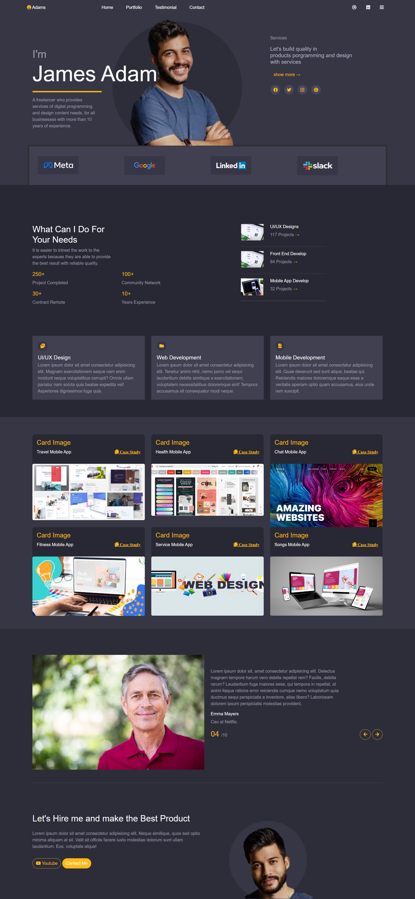

<h1 align="center">Portfolio Design</h1>

<h2>About the project</h2>

  
A <strong>Custom Portfolio</strong> design, that can help you creating your own portfolio, basically this design is a clone of the templates available at themeforest

👉 Live Demo: <a href='https://juniorawan06.github.io/adams-portfolio/](https://haseebk06.github.io/adams-portfolio/'>Live Demo</a>

<h3>Build with:</h3>

» Html  
» Css  
» JS

<h2>Screenshots of the Project 📸</h2>
 
<h3 align='center'> Ladning Page 🏡</h3>

